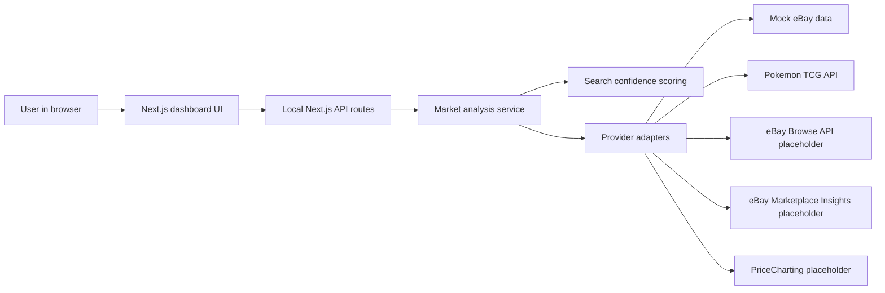
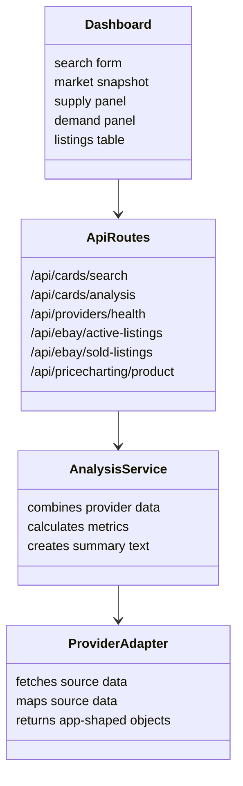
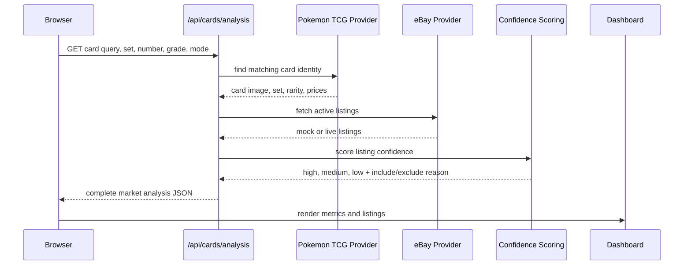
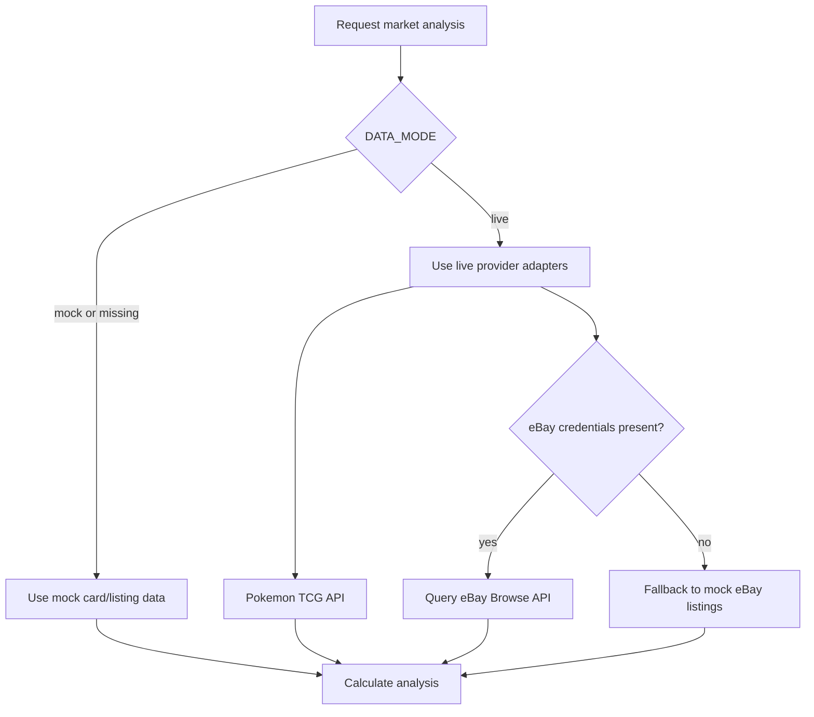
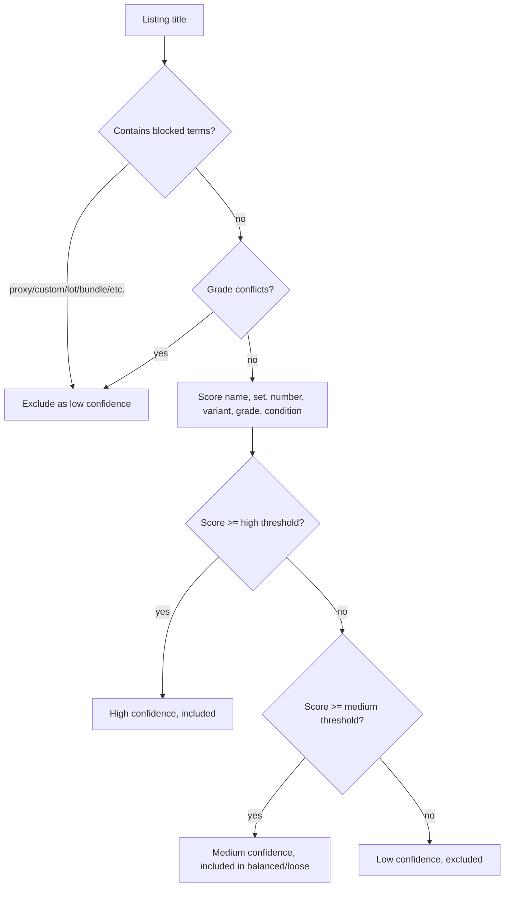
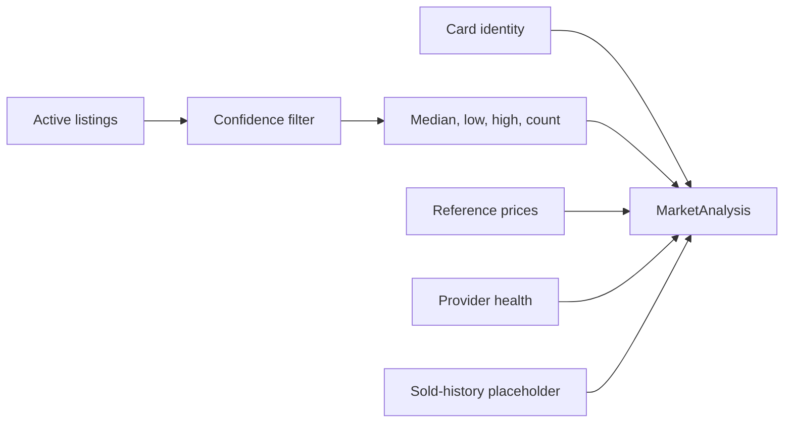

# Pokemon Card Market Tracker Architecture

This document explains how the local MVP is structured, how data moves through the app, and where live API integrations will plug in later.

## High-Level Architecture

The app is a local Next.js web application. The browser never talks directly to eBay, PriceCharting, or the Pokemon TCG API. Instead, the frontend calls local backend API routes, and those routes call provider modules on the server side.



## Main Design Pattern

The app uses a simple **provider adapter pattern**.

Each external data source is wrapped behind a local provider module. The rest of the app does not need to know the exact API format for eBay, Pokemon TCG API, or PriceCharting.



This makes it easier to replace mock data with live data later without redesigning the dashboard.

## Data Flow

When you search for a card, the app follows this flow:



## Important Folders

```txt
src/
  app/
    page.tsx                  Dashboard UI
    api/                      Backend API routes
  lib/
    analysis.ts               Combines provider data and calculates metrics
    env.ts                    Reads environment variables
    market/
      math.ts                 Median and money helpers
      search.ts               Listing confidence and filtering logic
    providers/
      pokemonTcg.ts           Pokemon TCG API provider
      ebay.ts                 eBay active/sold listing provider
      mock.ts                 Mock cards and mock eBay listings
      priceCharting.ts        PriceCharting placeholder
      health.ts               Provider connection status
  types/
    market.ts                 Shared TypeScript data shapes
```

## API Route Map

| Route | Purpose | Current State |
| --- | --- | --- |
| `/api/cards/search` | Search card identity data | Uses mock data in mock mode, Pokemon TCG API in live mode |
| `/api/cards/analysis` | Main dashboard analysis endpoint | Working |
| `/api/cards/snapshots` | Save a demand snapshot and return trend history | Working, local persistence |
| `/api/providers/health` | Shows provider connection status | Working |
| `/api/ebay/active-listings` | Active eBay supply listings | Mock now, live-ready later |
| `/api/ebay/sold-listings` | Sold-history demand listings | Placeholder until eBay approval |
| `/api/market/overview` | Market overview and discovery leaderboards | Working with mock/current provider data |
| `/api/pricecharting/product` | Optional PriceCharting lookup | Placeholder until token/API format is confirmed |

## Mock Mode vs Live Mode

The environment variable `DATA_MODE` controls whether the app uses mock data or live providers.



Mock mode is intentional. It lets the dashboard, filtering, and analysis work before eBay approves your developer account.

## Search Confidence Model

Every listing receives a confidence score before it affects the analysis.



The app excludes noisy listings such as proxies, custom cards, lots, bundles, sealed products, and wrong-grade matches from calculations by default.

## Market Analysis Calculation

The main analysis endpoint returns one combined `MarketAnalysis` object.

It includes:

- card identity
- provider health
- reference price
- active listings
- sold listings placeholder
- market metrics
- grade/condition breakdown
- plain-English summary

## Demand History

Demand history is stored locally in `.local-data/demand-snapshots.json`, which is excluded from git. The dashboard saves snapshots manually so a user decides which card searches to track.

When sold-history data becomes available, the demand score uses:

```txt
45% sell-through + 25% sales velocity + 20% price strength + 10% listing quality
```

Without sold history, the app clearly labels the score as a low-confidence active-listing proxy. Two or more saved snapshots allow the dashboard to show movement from the previous score and rolling 7-day/30-day comparisons.



## Current Limitations

- eBay active listings use mock data unless `DATA_MODE=live` and eBay credentials are present.
- eBay sold-history demand analysis is not live; eBay currently documents Marketplace Insights as restricted and not open to new users.
- PriceCharting is only a placeholder provider for now.
- Trend analysis is conservative because true historical sold data is not available yet.

## How To Add Live eBay Later

Once your eBay developer account is approved:

1. Create `C:\Users\pande\Documents\New project\.env.local`.
2. Add your eBay credentials.
3. Set `DATA_MODE=live`.
4. Restart the dev server.
5. Test `/api/providers/health`.
6. Test `/api/ebay/active-listings`.

Example:

```env
DATA_MODE=live
EBAY_CLIENT_ID=your_client_id
EBAY_CLIENT_SECRET=your_client_secret
EBAY_MARKETPLACE_ID=EBAY_US
```

Do not put real secrets in committed files.

## Future Architecture Upgrades

Good next steps:

- Add a small database to store historical snapshots.
- Add scheduled price checks.
- Add real sold-history metrics after selecting an available sold-data provider.
- Add a watchlist for cards you care about.
- Add provider-specific caching and rate-limit handling.
- Add tests for confidence scoring and provider adapters.
